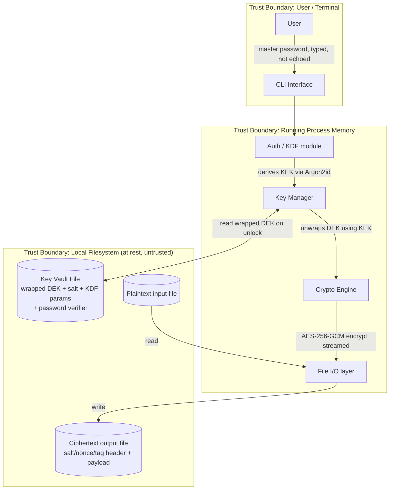

# File Manager — Checkpoint 1: Threat Model & Architecture

## 1. Scope

A command-line tool that lets a user encrypt and decrypt individual files
on disk under a single master password, without ever writing the master
password or the derived key material to disk in the clear. This document
covers architecture, trust boundaries, and threat model only, no crypto
code is implemented yet.

## 2. System Architecture

### 2.1 Components

- **CLI Interface** (`cli.py`) — parses commands/arguments, prompts for
  the master password (never accepted as a plain CLI argument, to avoid
  it appearing in shell history / `ps`), dispatches to the other modules.
- **Auth / KDF module** (`key_manager.py`) — turns the master password
  into a Key-Encryption-Key (KEK) via a password-hardening KDF. Also
  verifies the password against a stored verifier at unlock time.
- **Key Manager** (`key_manager.py`) — generates the random per-vault
  Data-Encryption-Key (DEK), wraps/unwraps it with the KEK, and holds
  the unwrapped DEK only in memory for the duration of a command.
- **Crypto Engine** (`crypto_engine.py`) — performs authenticated
  encryption/decryption of file contents using the DEK.
- **File I/O layer** (`file_io.py`) — reads plaintext/ciphertext,
  streams data in chunks, writes output atomically (temp file + rename).
- **Filesystem** — stores: (a) encrypted files, each with a header
  containing salt/nonce/tag metadata, and (b) the key vault file
  (wrapped DEK + KDF parameters + password verifier). No plaintext
  secrets are ever persisted.

### 2.2 Data flow (happy path: `filemgr encrypt <file>`)

### 2.3 Where files and keys live

| Item | Location | Form at rest |
|---|---|---|
| Master password | Never stored | Exists only transiently in process memory |
| KEK (Key-Encryption-Key) | Never stored | Derived in memory from master password + salt each run |
| DEK (Data-Encryption-Key) | `vault.key` file, alongside app config (e.g. `~/.filemgr/`) | Encrypted ("wrapped") with the KEK; never written in plaintext |
| Salt + KDF parameters | Same vault file | Plaintext (not secret — needed to re-derive KEK) |
| Password verifier | Same vault file | A KDF-derived check value, not the password itself |
| Plaintext files | Wherever the user points the tool | Unmodified, user-owned |
| Encrypted files | Output path given by user (default: alongside original, `.enc` suffix) | Ciphertext + header (salt, nonce, tag) |

### 2.4 Trust boundaries

1. **User ↔ CLI**: the terminal/TTY is trusted to deliver the password
   without a keylogger; out of scope to defend against a compromised
   host.
2. **Process memory ↔ Disk**: everything on disk is treated as
   untrusted/exposed — this is the boundary the whole design protects
   across (an attacker with filesystem access, or a stolen backup,
   should get nothing usable).
3. **Process memory ↔ Process memory over time**: key material should
   live as briefly as possible and not be paged to swap or leaked via
   crash dumps/logs (best-effort in Python; noted as a limitation).

## 3. Threat Model

Format: **Threat → Mitigation**. STRIDE-ish categories noted in brackets.

### 3.1 File handling

| # | Threat | Mitigation |
|---|---|---|
| F1 | Ciphertext tampering / bit-flipping to corrupt or manipulate decrypted output [Tampering] | Use an AEAD cipher (AES-256-GCM), not plain CBC; decryption fails closed if the authentication tag doesn't verify |
| F2 | Path traversal via crafted filenames/output paths (`../../etc/passwd`) [Elevation of Privilege] | Resolve and canonicalize paths (`os.path.realpath`), reject paths that escape an expected working directory unless the user explicitly opts in |
| F3 | Crash or power loss during write leaves a corrupted/partial output file [Tampering / availability] | Write ciphertext to a temp file in the same directory, `fsync`, then atomically `rename()` over the destination |
| F4 | Memory exhaustion / DoS from loading an entire large file into RAM [Denial of Service] | Stream encryption/decryption in fixed-size chunks rather than reading whole files into memory |
| F5 | Leftover plaintext in temp files, editor swap files, or the OS recycle bin after encrypting [Information Disclosure] | Never write intermediate plaintext to disk; document that secure deletion of the *original* plaintext (if requested) is best-effort only, since SSD wear-levelling can't be fully controlled from user space |
| F6 | Symlink attack — output path is a symlink to a sensitive file the user didn't intend to overwrite [Tampering] | Open output path with flags that refuse to follow symlinks (e.g. `O_NOFOLLOW`) before writing |

### 3.2 Authentication (master password entry)

| # | Threat | Mitigation |
|---|---|---|
| A1 | Offline brute-force / dictionary attack against a stolen vault file [Spoofing] | Argon2id KDF with tuned memory/time/parallelism cost, plus a large random per-vault salt so precomputed tables don't help |
| A2 | Weak, guessable master password chosen by the user [Spoofing] | Enforce a minimum length/entropy check at `init`/`change-password` time; recommend passphrases |
| A3 | Password captured via shell history or process list if passed as a CLI argument [Information Disclosure] | Never accept the password as a command-line argument; always prompt via `getpass` (no echo), optionally support reading from an env var only for scripted/test use, clearly documented as less secure |
| A4 | Timing side-channel on password/verifier comparison [Information Disclosure] | Use constant-time comparison (`hmac.compare_digest`) for verifier checks |
| A5 | Unlimited guess attempts if the tool is ever exposed as a service later [Spoofing] | Not applicable to a local CLI today, but noted as a design constraint if the tool grows a daemon/API mode |

### 3.3 Key and password handling

| # | Threat | Mitigation |
|---|---|---|
| K1 | DEK stored in plaintext on disk [Information Disclosure] | DEK is always stored wrapped (encrypted) under the KEK; the KEK itself is never stored, only re-derived from the password each run |
| K2 | Key material lingering in process memory longer than necessary, recoverable via memory dump/swap [Information Disclosure] | Scope key variables as tightly as possible, drop references immediately after use, avoid unnecessary copies; documented as best-effort in Python (no hard memory-zeroing guarantee at the interpreter level — noted as a known limitation, candidate for a lower-level language if this becomes a concern) |
| K3 | Secrets accidentally written to logs, stack traces, or debug output [Information Disclosure] | No secret values (password, KEK, DEK) are ever passed to logging calls; custom exception handling strips sensitive locals before printing |
| K4 | Vault file corruption or loss with no way to recover the DEK [Availability] | Out of scope for v1 (no backdoor/escrow — that would itself be a security weakness); documented clearly to the user that password loss = data loss |
| K5 | Reused nonce/IV under the same key breaking GCM's confidentiality and integrity guarantees [Tampering / Information Disclosure] | Generate a fresh random 96-bit nonce per encryption operation and store it in the file header; never reuse a DEK+nonce pair |
| K6 | Master password reused across encrypt/decrypt sessions typed insecurely (e.g. visible on screen) [Information Disclosure] | Always use no-echo password prompts; never print the password back to the terminal |

## 4. Implementation Language & Libraries

**Chosen language: Python 3.11+**

**Chosen libraries:**
- [`cryptography`](https://cryptography.io/) — provides `AESGCM` (AEAD
  encryption) and `Scrypt`/KDF primitives via its high-level "hazmat
  recipes" layer, backed by OpenSSL's `libcrypto`.
- `argon2-cffi` — for Argon2id password-based key derivation
  (the current OWASP-recommended KDF for password hashing/derivation,
  stronger against GPU/ASIC cracking than PBKDF2 or plain scrypt).
- `click` (or `argparse` from the standard library) — CLI argument
  parsing and subcommands.

**Justification:**

- **Memory safety.** Python avoids the buffer-overflow / use-after-free
  class of bugs that a C + OpenSSL implementation would risk, which
  matters a lot for a tool whose entire job is handling secrets.
- **Audited primitives, not hand-rolled crypto.** `cryptography`'s
  high-level layer intentionally limits misuse-prone choices (e.g. it
  nudges toward AEAD over unauthenticated modes), while still sitting
  on top of the same well-vetted OpenSSL `libcrypto` that a C
  implementation would use directly.
- **Fast to build correctly within the course timeline.** A CLI file
  tool doesn't need C's raw performance; Python lets more of the
  checkpoint effort go into getting the crypto *design* and threat
  model right rather than fighting memory management.
- **`cryptography` vs `PyCryptodome`:** both are reasonable; `cryptography`
  was chosen for its stronger maintenance cadence, its explicit
  "recipes vs hazmat" API split (which makes it harder to accidentally
  pick an insecure mode), and its OpenSSL backend.
- **Known trade-off:** Python cannot guarantee secure zeroing of memory
  (no equivalent to C's `explicit_bzero`), so key lifetime in RAM is
  best-effort, not guaranteed — recorded above as threat K2 and
  accepted as a documented limitation for this course project.
